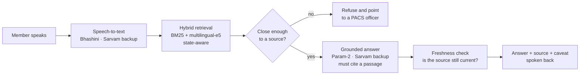

# Sahakar Saathi

**A voice-first, multilingual assistant for members of Primary Agricultural Credit Societies (PACS).**
Built by team **CALMARA** for **Smart India Hackathon 2026**, problem statement **PS26088: Multilingual Cooperative Governance & Legal Assistance Chatbot** (Ministry of Cooperation).

A farmer speaks a question in their own language, at a PACS kiosk or on the web, about crop insurance, a Kisan Credit Card loan, a cooperative scheme or their rights as a member. They hear an answer back that names the government document it comes from. If no document supports an answer, the assistant says so and points them to a person instead of guessing.

---

## Why it exists

- Cooperative law, scheme rules and PMFBY circulars are published in English or Hindi text. Many PACS members read neither comfortably.
- Missed enrolment and claim deadlines cost farmers real money, and the rules change.
- Middlemen charge fees for services that are free, and a confident wrong answer is what they exploit.

So the assistant is built around three rules: **answer only from a source**, **say when the source may be out of date**, and **refuse rather than guess**.

## What it does

| Feature | What the member gets |
|---|---|
| **Ask** (`/chat`) | Voice or text questions, answered in the language they were asked in, with the source document named |
| **PACS kiosk** (`/kiosk`) | A touch-and-speak screen for members without a smartphone; keeps answering offline from an on-device fallback |
| **Is this true?** (`/verify`) | Repeat what someone told you (a fee, a rule, a deadline) and get TRUE or FALSE against the official rule before paying anyone |
| **What am I missing?** (`/entitlements`) | Five simple questions (land, tenancy, KCC, insurance, gender) return the schemes the member qualifies for and is not claiming |
| **Risk & deadline alerts** (`/alerts`) | Enrolment countdowns and peril advisories for the member's district |
| **Grievance tracker** (`/grievance`) | File a structured complaint and track it by ticket ID |
| **Signed receipts** (`/r/[token]`) | The kiosk prints a QR slip for an answer; scanning it re-checks the rule *today*, so an old or forged printout cannot pass as current advice |
| **Admin dashboard** (`/admin`) | Query volumes by domain and language, clusters of complaints against the same PACS, and the freshness of every government source |

### Languages

English, Hindi, Marathi, Bengali, Gujarati, Punjabi, Odia, Tamil, Telugu, Kannada and Malayalam: **11 languages** for questions, answers and speech. Typed input is detected by script; Hindi and Marathi, which share Devanagari, are told apart by vocabulary.

## How an answer is produced



1. **Retrieval.** BM25 (exact terms like "PMFBY", "KCC", section numbers) and dense retrieval (paraphrase, cross-language) are fused with Reciprocal Rank Fusion. Passages from other states are demoted, so a Tamil Nadu member is not quoted Karnataka's loan terms.
2. **Refusal gate.** Dense retrieval always returns *something*, so a measured similarity floor decides whether anything is actually relevant. The threshold is tuned on answerable and unanswerable questions (`npm run tune:threshold`).
3. **Grounded generation.** The model sees only the retrieved passages, must cite the one it used, and must reply `INSUFFICIENT_CONTEXT` rather than fill a gap. Without a chat model the route still returns the passage itself, translated.
4. **Freshness.** Every passage is tied to a watched government source. A daily job (and a live re-check every six hours) fetches those documents and portals. If one changes or goes dark, every answer drawn from it is served with a warning on every channel, with no human sign-off needed to raise the flag.
5. **Free-service line.** Every spoken answer ends by reminding the member that nobody may charge them for a government scheme.

## Measured

| Metric | Result |
|---|---|
| Retrieval, correct passage ranked first | **38 / 38 (100%)** on the labelled question set in Hindi, English and Tamil (`npm run eval:retrieval`) |
| Retrieval, correct passage in top 3 | **38 / 38 (100%)** |
| Refusal gap | lowest on-topic 0.837 vs highest off-topic 0.798 similarity |
| Government sources monitored | 18 (central schemes plus Karnataka, Telangana, Andhra Pradesh, Kerala and Tamil Nadu) |

## AI stack

| Task | Primary | Backup |
|---|---|---|
| Answer generation | **BharatGen Param-2**, served with vLLM | Sarvam |
| Speech-to-text, text-to-speech, translation | **Bhashini** (MeitY) | Sarvam |
| Embeddings | **multilingual-e5-small**, run in-process (no API, works offline) | — |
| Vector search | **pgvector** on Supabase (Mumbai) | in-process vectors |

Every primary is optional. With only `SARVAM_API_KEY` set, the whole app runs end to end, and the primaries take over as soon as their keys are added.

Serving Param-2 on a GPU:

```bash
pip install vllm
vllm serve bharatgenai/Param2-17B-A2.4B-Thinking --api-key <key>
# then set PARAM2_BASE_URL=http://<host>:8000/v1 and PARAM2_API_KEY=<key>
```

## Getting started

Requirements: Node.js 20+.

```bash
npm install
cp .env.example .env    # at minimum, set SARVAM_API_KEY
npm run dev
```

Open http://localhost:3000. Every variable is documented in `.env.example`. The first question downloads the e5 model (~120 MB) once.

### Scripts

```bash
npm run eval:retrieval   # retrieval accuracy over the labelled questions
npm run tune:threshold   # re-measure the refusal threshold
npm run index:corpus     # embed the corpus; writes lib/rag/vectors.json and pgvector
npm run verify:index     # check both indexes match the corpus
npm run check:sources    # re-verify every watched government source now
npm run translate:ui     # generate interface strings for newly added languages
```

## Kiosk hardware

A low-cost kiosk built from off-the-shelf parts:

- **ESP32** with a **MAX4466** microphone and I2S speaker (`hardware/esp32-kiosk/`). It detects speech on-device and streams audio to a host.
- A **host script** (`hardware/laptop/kiosk_host.py`) runs speech-to-text, the answer and text-to-speech through this service, and plays the reply.
- `/api/tts/raw` streams raw PCM at the device's own sample rate, so the microcontroller never parses JSON or base64.

Before flashing, set `WIFI_SSID` and `WIFI_PASS` in the sketch. The ESP32 supports 2.4 GHz only.

## Project layout

| Path | What it is |
|---|---|
| `app/` | Next.js pages: chat, kiosk, verify, entitlements, alerts, grievances, admin, receipt check |
| `app/api/` | Question answering (plain and streaming), speech-to-text, text-to-speech, receipts, daily source-check cron |
| `lib/rag/` | Corpus, BM25, embeddings, hybrid retrieval, grounded generation, translation |
| `lib/speech/` | Bhashini client, speech synthesis, browser WAV conversion |
| `lib/sources/` | Registry of watched government sources and the checks that flag changed documents or dead portals |
| `lib/server/` | Database access through locked-down database functions only |
| `hardware/` | ESP32 firmware, microphone test sketches, kiosk host script |
| `scripts/` | Evaluation, threshold tuning, indexing, source checks, translation |

## Privacy and safety

- No API key ever reaches the browser; speech and model calls are proxied server-side.
- Embeddings run inside the server, so a member's question is not sent anywhere to be embedded.
- Database tables are closed to direct access; the app can only call specific database functions, and officer actions require a server-held secret.
- Answers are general information about published rules, not legal advice. For a binding decision, members should consult their Registrar of Cooperative Societies.

## Status and roadmap

This is a working prototype. Built and running today: everything in *What it does* above, in 11 languages, with source monitoring and signed receipts.

In progress:

- Grievances and officer hand-off stored centrally (today the tracker keeps tickets on the device, and the dashboard shows demo baseline figures)
- Officer login for the admin dashboard
- A dedicated agent for PACS services and financial literacy (KCC, loans)
- Clause-level passages from the state Co-operative Societies Acts and the Model Bye-laws for PACS
- Reading a photographed notice aloud
- Toll-free IVR and SMS ticket updates for feature phones

## Sources

Answers are drawn from published material including PMFBY operational guidelines, PM-KISAN guidelines, NABARD's Modified Interest Subvention Scheme, MNRE PM-KUSUM, Press Information Bureau releases, and the Departments of Cooperation of Karnataka, Kerala, Tamil Nadu, Telangana and Andhra Pradesh. Each passage in `lib/rag/` records its source, URL and the date it was last checked.
